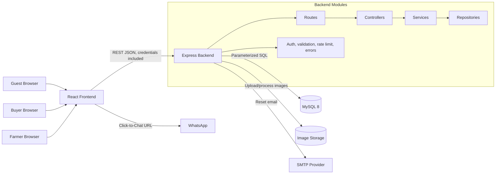

# CultivaX Architecture Plan

## Three-Tier Architecture

CultivaX will use a three-tier web architecture:

1. **Presentation tier:** React, Vite, React Router, TanStack Query, Axios, plain CSS, and Lucide React in the `frontend` application.
2. **Application tier:** Node.js and Express in the `backend` application, organized into routes, controllers, services, repositories, middleware, validators, utilities, and configuration.
3. **Data tier:** MySQL 8 for relational application data, with local/server filesystem image storage for uploaded product photos.

The frontend never queries MySQL directly. It calls REST endpoints on the Express API. The backend owns validation, authorization, password hashing, JWT cookie issuance, SQL access, image processing, and email-reset token handling.

## Responsibilities

### Frontend

- Render public marketplace, product details, comparison, authentication, and farmer dashboard pages.
- Validate form shape early for usability while treating backend validation as authoritative.
- Store comparison product IDs in `localStorage`, with a maximum of four products.
- Generate user-facing links and navigation from API responses.
- Use Axios with credentials enabled so secure HttpOnly JWT cookies are sent automatically.
- Show clear validation, loading, empty, unauthorized, and not-found states.

### Backend

- Expose REST APIs for authentication, profiles, product listings, public marketplace reads, comparison reads, and contact-click logging.
- Hash passwords with `bcryptjs`.
- Issue and verify JWTs stored in secure HttpOnly cookies.
- Normalize phone numbers to E.164 using `libphonenumber-js`.
- Authorize farmer-only actions and enforce ownership on farmer profiles and products.
- Validate request bodies and query strings with `express-validator`.
- Use parameterized SQL through `mysql2/promise`.
- Return consistent JSON errors without exposing password hashes, reset tokens, stack traces, or private configuration.

### Database

- Store users, farmer profiles, products, product images, contact clicks, and password reset tokens.
- Use numeric MySQL primary keys.
- Enforce unique normalized email and phone values where present.
- Support product search, filtering, sorting, ownership checks, and dashboard counts with appropriate indexes.

### Image Storage

- Product uploads are accepted by the backend with `multer`.
- Images are processed with `sharp` into web-friendly formats and sizes.
- Image metadata is stored in `product_images`; image files are stored on disk under a configured upload directory.
- Product deletion is a real delete for this MVP. The backend deletes database rows in a transaction, then removes associated image files. If file cleanup fails after database deletion, the failure is logged for manual cleanup without exposing internal paths to clients.

### Email Reset

- Password reset uses `nodemailer` to send reset links for accounts that have an email address.
- Reset tokens are never stored in plain text. The backend stores a token hash, expiry time, and usage timestamp in `password_reset_tokens`.
- Reset responses do not reveal whether an email exists.

## Mermaid Architecture Diagram

## Authentication and Authorization Flow

1. User registers as `farmer` or `buyer` with phone, optional email, password, and display name.
2. Backend validates uniqueness, normalizes phone to E.164, hashes password, and stores the user.
3. User logs in using phone or email plus password.
4. Backend verifies credentials and returns safe user fields while setting a secure HttpOnly JWT cookie.
5. Frontend calls `/api/auth/me` to restore session state.
6. Farmer-only endpoints require a valid JWT with role `farmer`.
7. Product and profile mutations also check ownership in the repository/service layer.
8. Logout clears the auth cookie.

## Product Creation Flow

1. Farmer opens the product creation page.
2. Frontend validates required fields and requires at least one image before submit.
3. Frontend sends `multipart/form-data` to `POST /api/farmer/products`.
4. Backend verifies the JWT, role, and farmer profile ownership.
5. Backend validates product fields and image constraints.
6. Backend processes images with `sharp`.
7. Backend uses a transaction to insert the product and image metadata.
8. Backend returns the created product with safe public image URLs.
9. Frontend updates the farmer dashboard cache.

## Public Marketplace Search Flow

1. Guest, buyer, or farmer visits the marketplace.
2. Frontend sends query parameters to `GET /api/products`, including keyword, category, location, min price, max price, and sort.
3. Backend validates query parameters.
4. Repository builds a parameterized SQL query using only whitelisted filters and sort values.
5. Backend returns active, non-sold-out products with safe farmer fields and primary image data.
6. Frontend renders product cards, empty states, pagination/load states, and comparison controls.

## WhatsApp Contact-Click Flow

1. Guest or buyer opens a product detail page or product card contact action.
2. Frontend builds a WhatsApp message containing product context.
3. Frontend generates the WhatsApp number by stripping the leading plus and all non-digits from the farmer phone.
4. Frontend calls `POST /api/products/:id/contact-clicks` before navigation. Auth is optional, so `buyerId` can be nullable.
5. Backend verifies the product is public, records `product_id`, nullable `buyer_id`, contact channel, and timestamp.
6. Frontend opens the WhatsApp Click-to-Chat link and also displays a tappable farmer phone fallback.
