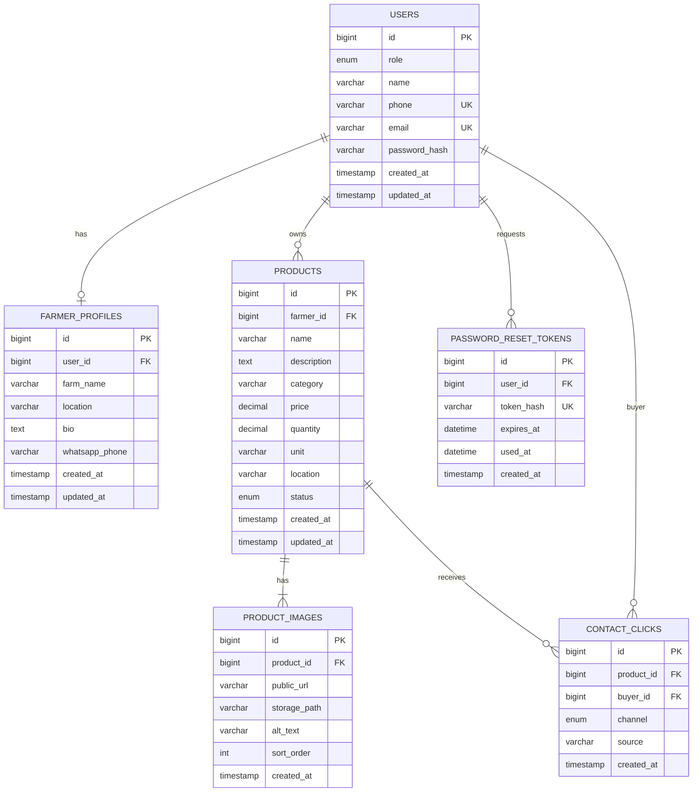

# Database Design Plan

CultivaX will use MySQL 8 with numeric primary keys. All dynamic SQL will use parameterized queries through `mysql2/promise`.

## Tables

### `users`

| Column | Type | Constraints |
| --- | --- | --- |
| `id` | `BIGINT UNSIGNED` | Primary key, auto increment |
| `role` | `ENUM('farmer','buyer')` | Not null |
| `name` | `VARCHAR(120)` | Not null |
| `phone` | `VARCHAR(32)` | Not null, unique, normalized E.164 |
| `email` | `VARCHAR(255)` | Nullable, unique |
| `password_hash` | `VARCHAR(255)` | Not null |
| `created_at` | `TIMESTAMP` | Not null, default current timestamp |
| `updated_at` | `TIMESTAMP` | Not null, default current timestamp on update |

Indexes:

- Unique index on `phone`
- Unique index on `email`
- Index on `role`

### `farmer_profiles`

| Column | Type | Constraints |
| --- | --- | --- |
| `id` | `BIGINT UNSIGNED` | Primary key, auto increment |
| `user_id` | `BIGINT UNSIGNED` | Not null, unique, foreign key to `users.id` |
| `farm_name` | `VARCHAR(160)` | Not null |
| `location` | `VARCHAR(160)` | Not null |
| `bio` | `TEXT` | Nullable |
| `whatsapp_phone` | `VARCHAR(32)` | Nullable, normalized E.164 |
| `created_at` | `TIMESTAMP` | Not null, default current timestamp |
| `updated_at` | `TIMESTAMP` | Not null, default current timestamp on update |

Indexes:

- Unique index on `user_id`
- Index on `location`

### `products`

| Column | Type | Constraints |
| --- | --- | --- |
| `id` | `BIGINT UNSIGNED` | Primary key, auto increment |
| `farmer_id` | `BIGINT UNSIGNED` | Not null, foreign key to `users.id` |
| `name` | `VARCHAR(160)` | Not null |
| `description` | `TEXT` | Nullable |
| `category` | `VARCHAR(80)` | Not null |
| `price` | `DECIMAL(10,2)` | Not null, `price >= 0` |
| `quantity` | `DECIMAL(10,2)` | Not null, `quantity >= 0` |
| `unit` | `VARCHAR(40)` | Not null |
| `location` | `VARCHAR(160)` | Not null |
| `status` | `ENUM('active','sold_out','inactive')` | Not null, default `active` |
| `created_at` | `TIMESTAMP` | Not null, default current timestamp |
| `updated_at` | `TIMESTAMP` | Not null, default current timestamp on update |

Indexes:

- Index on `farmer_id`
- Index on `status`
- Index on `category`
- Index on `location`
- Index on `price`
- Index on `created_at`
- Full-text index on `name`, `description`, `category`, `location` if supported by the final MySQL configuration; otherwise planned keyword search will use parameterized `LIKE` conditions.

### `product_images`

| Column | Type | Constraints |
| --- | --- | --- |
| `id` | `BIGINT UNSIGNED` | Primary key, auto increment |
| `product_id` | `BIGINT UNSIGNED` | Not null, foreign key to `products.id` with cascade delete |
| `public_url` | `VARCHAR(500)` | Not null |
| `storage_path` | `VARCHAR(500)` | Not null, not returned by public APIs |
| `alt_text` | `VARCHAR(180)` | Nullable |
| `sort_order` | `INT UNSIGNED` | Not null, default `0` |
| `created_at` | `TIMESTAMP` | Not null, default current timestamp |

Indexes:

- Index on `product_id`
- Composite index on `product_id`, `sort_order`

### `password_reset_tokens`

| Column | Type | Constraints |
| --- | --- | --- |
| `id` | `BIGINT UNSIGNED` | Primary key, auto increment |
| `user_id` | `BIGINT UNSIGNED` | Not null, foreign key to `users.id` with cascade delete |
| `token_hash` | `VARCHAR(255)` | Not null, unique |
| `expires_at` | `DATETIME` | Not null |
| `used_at` | `DATETIME` | Nullable |
| `created_at` | `TIMESTAMP` | Not null, default current timestamp |

Indexes:

- Unique index on `token_hash`
- Index on `user_id`
- Index on `expires_at`

This table is required even though it supports implementation rather than a marketplace domain object. Password reset needs a way to issue a time-limited, single-use secret without storing the raw token or exposing whether an account exists. Storing a hash of the token allows the backend to validate reset links, expire old tokens, invalidate used tokens, and audit reset attempts safely.

### `contact_clicks`

| Column | Type | Constraints |
| --- | --- | --- |
| `id` | `BIGINT UNSIGNED` | Primary key, auto increment |
| `product_id` | `BIGINT UNSIGNED` | Not null, foreign key to `products.id` |
| `buyer_id` | `BIGINT UNSIGNED` | Nullable, foreign key to `users.id` |
| `channel` | `ENUM('whatsapp','phone')` | Not null |
| `source` | `VARCHAR(80)` | Nullable |
| `created_at` | `TIMESTAMP` | Not null, default current timestamp |

Indexes:

- Index on `product_id`
- Index on `buyer_id`
- Index on `created_at`

`buyer_id` is nullable so guest visitors can still generate contact-click analytics.

## Relationships

- One `users` row with role `farmer` has zero or one `farmer_profiles` row.
- One farmer `users` row owns many `products`.
- One `products` row has one or many `product_images`.
- One `users` row can have many `password_reset_tokens`.
- One `products` row can have many `contact_clicks`.
- One buyer `users` row can have many `contact_clicks`, but guest clicks store `buyer_id = NULL`.

## Mermaid ER Diagram

